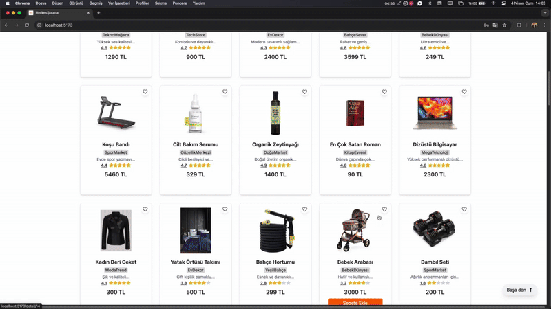
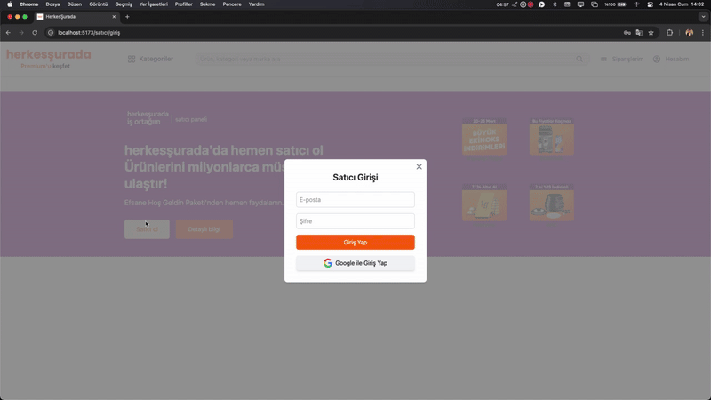
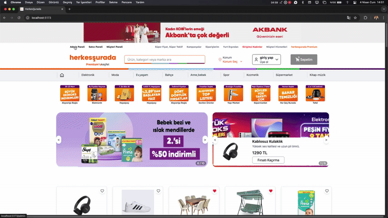

# 🛒 Pazar Yeri E-Ticaret Projesi

Bu proje, birden fazla kullanıcı rolüne sahip (müşteri, satıcı, admin) **kapsamlı bir pazar yeri e-ticaret platformudur.** Kullanıcıların ürünleri görüntüleyip sipariş verebildiği, satıcıların ürün ekleyip satışlarını yönetebildiği ve adminin tüm yapıyı kontrol edebildiği gelişmiş bir sistemdir.

---

## 🔐 Giriş Özellikleri

- Kullanıcı, Satıcı ve Admin için ayrı giriş ekranları
- Google ile giriş ve Email/Şifre ile giriş seçenekleri
- Admin paneline sadece `@admin.com` uzantılı maillerle giriş yapılabilir
- Giriş yapılmadan hiçbir özel panele erişim mümkün değildir
- Giriş sonrası oturum yönetimi yapılır, çıkış butonları mevcuttur

---

## 🏠 Ana Sayfa (Home)

- Tüm ürünlerin listelendiği ana ekran
- Ürün arama özelliği
- Kategoriye göre filtreleme
- Ürün kartı bileşeni:
  - Ürün adı,Resim, fiyat, satıcı adı, yıldız puanı
  - Kargo bilgisi (ücretsiz kargo, hızlı teslimat gibi)
  - Favorilere ekleme butonu (kalp ikonu)
  - Sepete ekleme butonu
  - Detayına gitme

---

## 📦 Ürün Detay Sayfası

- Ürün görseli, adı, açıklaması
- Satıcı adı ve mağaza bağlantısı
- Fiyat bilgisi ve varsa indirim
- Kargo seçeneği (ücretsiz mi, tahmini teslim tarihi)
- Ürünün yıldız puanı
- Favorilere ve sepete ekleme seçenekleri
- Kullanıcı yorumları (eğer varsa)
- Güzel tasarlanmış, bilgi dolu bir detay ekranı

---

## 📝 Site Hakkında Alanı

- Siteyle ilgili açıklamaların yer aldığı bilgi alanı
- "Göster/Gizle" komutuyla kullanıcı bu bölümü açıp kapatabilir
- Basit ama etkili kullanıcı etkileşimi

---

## 📌 Footer

- İletişim bilgileri
- Hakkımızda, Gizlilik, Kullanım Koşulları gibi sayfa bağlantıları
- Sosyal medya ikonları
- Ekstra linkler (yardım merkezi, iş birliği, mağaza başvurusu vs.)

---

## 👤 Müşteri Paneli

> Giriş yapılmadan erişilemez. Google veya email ile giriş yapılabilir.

İçeriği:

- Gösterge Paneli: temel istatistikler, kısa bilgiler
- Kullanıcı Bilgileri: ad, mail, numara vb.
- Favori Ürünler Listesi: favorilere eklenen ürünler burada gösterilir
- Mesajlar: satıcılarla yapılan tüm konuşmalar
- Takip Edilen Mağazalar: kullanıcı hangi mağazaları takip ettiyse burada görünür
- Siparişlerim: yapılan tüm siparişlerin listesi, durumu, detayına gitme

---

## 🏬 Satıcı Paneli

> Giriş yapılmadan erişilemez. Google veya email ile giriş yapılabilir.

İçeriği:

- Gösterge Paneli: toplam gelir, sipariş sayısı, güncel siparişler
- Ürünler Listesi: satıcının eklediği tüm ürünler burada
- Yeni Ürün Ekleme: ürün adı, açıklaması, fiyatı, resim vs.
- Kategoriler Listesi: ürünler hangi kategorideyse yönetilebilir
- Siparişler Listesi: gelen siparişleri ve durumlarını görür
- Müşteri Listesi: ürünlerinden sipariş veren kullanıcıların bilgileri
- Kargo Listesi: siparişlerin kargo süreçlerini takip eder

---

## 🛠️ Admin Paneli

> Sadece admin uzantılı mail ile giriş yapılabilir. Diğer maillerle erişim yasaktır.

İçeriği:

- Gösterge Paneli: genel istatistikler (toplam kullanıcı, ürün, sipariş)
- Müşteri Listesi: kayıtlı tüm kullanıcılar
- Satıcı Listesi: kayıtlı tüm mağaza sahipleri
- Ürünler Listesi: sitede bulunan tüm ürünler
- Gerektiğinde sistemden kullanıcı veya ürün silme, güncelleme işlemleri

---

### ⚙️ Kullanılan Teknolojiler

- **🧩 Frontend Teknolojileri**
- **_React_** – Component tabanlı kullanıcı arayüzü oluşturmak için
- **_TypeScript_** – Tip güvenliği ile daha sağlam ve anlaşılır kodlar
- **_Tailwind CSS_** – Hızlı ve modern tasarım için utility-first CSS kütüphanesi
- **_React Router DOM_** – Sayfalar arası yönlendirme ve route işlemleri
- **_React Icons_** – Popüler ikon kütüphanesi (FontAwesome, HeroIcons vb.)
- **_React Hot Toast_** – Uyarı ve bildirim sistemleri
- **_React Paginate_** – Sayfalama (pagination) işlevselliği
- **_React Google Charts_** – Grafik ve veri görselleştirme
- **_Splide.js_** (@splidejs/react-splide, @splidejs/splide) – Slider/carousel yapısı

**🧠 State Management**

- **_Redux_** – Global state yönetimi
- **_@reduxjs/toolkit_** – Redux'u daha basit ve verimli kullanmak için
- **_react-redux_** – React uygulaması ile Redux entegrasyonu
- **_redux-persist_** – Redux state'ini kalıcı hale getirmek için (localStorage kullanımı)

**🔐 Authentication (Giriş İşlemleri)**

- **_Firebase Authentication_** – Google ve Email/Şifre ile kullanıcı, satıcı ve admin girişleri

**🌐 API & Yardımcı Kütüphaneler**

- **_Axios_** – API istekleri için HTTP istemcisi
- **_uuid_** – Benzersiz kimlik (ID) üretmek için
- **_json-server_** – Geliştirme sürecinde mock API kullanımı

**⚙️ Geliştirme Ortamı**

- **_Vite_** – Hızlı başlatma ve geliştirme için modern build aracı
- **_CURSOR_** – Kod geliştirme editörü

## 📷 GIF Görselleri

Aşağıdaki bölümler için hazırlanmış 4 adet tanıtım GIF'i:

### 🏠 Home Sayfası

### 👤 Müşteri Paneli

### 🏬 Satıcı Paneli

### 🛠️ Admin Paneli

